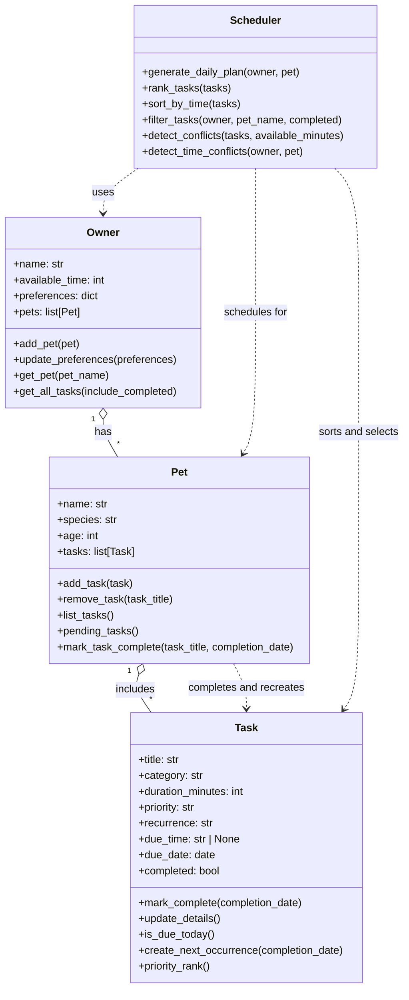

# PawPal+ Project Reflection

## 1. System Design

**a. Initial design**

- My initial design used four classes: `Owner`, `Pet`, `Task`, and `Scheduler`. I chose these classes because they map directly to the main parts of the problem: the person managing care, the animal receiving care, the individual care actions, and the logic that turns tasks into a daily plan.
- The `Owner` class is responsible for storing the owner's name, available time, preferences, and connected pets. Its role is to represent the human side of the system and provide the constraints the scheduler must respect.
- The `Pet` class is responsible for storing the pet's basic information and the list of care tasks assigned to that pet. Its role is to group tasks around a specific animal so the app can build schedules for the correct pet.
- The `Task` class is responsible for storing the details of each care activity, including title, category, duration, priority, recurrence, due time, and completion status. Its role is to represent the smallest unit of work that the scheduler will sort, filter, and schedule.
- The `Scheduler` class is responsible for the planning logic. Its role is to rank tasks, detect conflicts, and generate a daily plan based on the owner's available time and the pet's current task list.
- The main relationships are that one `Owner` can have multiple `Pet` objects, each `Pet` can have multiple `Task` objects, and the `Scheduler` depends on all three to produce an ordered schedule.

**b. Design changes**

- Yes. After reviewing the class skeleton, I changed the `Scheduler` design so it no longer stores its own `available_minutes` value.
- I made this change because the owner already stores available time, and keeping that information in two places would create an unnecessary synchronization problem. It would be easy for the two values to drift apart and produce confusing scheduling behavior.
- Instead, I kept time availability as part of the `Owner` data model and updated the scheduler interface so conflict detection can receive the available minutes it should use for a specific planning run. This keeps the scheduler more focused on logic and reduces the risk of inconsistent state.

---

## 2. Scheduling Logic and Tradeoffs

**a. Constraints and priorities**

- My scheduler considers several constraints: the owner's available time, each task's priority, each task's due date and due time, the task's completion status, and whether the task recurs daily or weekly. It also checks for exact-time conflicts so the system can warn the user when two tasks are scheduled for the same slot.
- I decided that time availability and task urgency mattered most because those constraints directly affect whether a plan is realistic. If the owner does not have enough time for every task, the scheduler needs to make a clear decision about what should happen first. Due time and priority became the main ranking signals, while recurrence and conflict warnings helped make the schedule more practical and easier to review.

**b. Tradeoffs**

- One tradeoff my scheduler makes is that its time-conflict detection only checks whether two tasks share the exact same due date and due time. It does not yet calculate whether task durations overlap, so a 9:00 task lasting 30 minutes and a 9:15 task lasting 20 minutes would not be flagged as a conflict.
- I considered making the conflict logic more advanced, but a more complete overlap algorithm would add extra complexity to the data model and the scheduler. For this project, exact-time matching is a reasonable lightweight rule because it is easy to explain, easy to test, and still catches obvious scheduling problems without making the code harder to read.

---

## 3. AI Collaboration

**a. How you used AI**

- I used VS Code Copilot for several different kinds of work: brainstorming the initial class design, drafting the Mermaid UML, scaffolding class skeletons, suggesting test cases, and reviewing algorithmic improvements for sorting, filtering, recurrence, and conflict detection. It was most effective when I used it as a fast design and implementation partner instead of treating it as an authority.
- The most effective Copilot features for building the scheduler were Chat for architecture and algorithm planning, inline code suggestions for small method implementations, and test generation for quickly drafting pytest cases. The most helpful prompts were concrete and code-aware, such as asking how the `Scheduler` should retrieve tasks from an `Owner`, how to sort `HH:MM` strings with `sorted()` and a lambda key, or what edge cases matter for recurring tasks and exact-time conflicts.

**b. Judgment and verification**

- One example of a suggestion I did not accept as-is was the idea of storing available time separately inside the `Scheduler`. I rejected that because the `Owner` already owned that information, and duplicating it would have created a synchronization problem where the scheduler and the owner could drift apart.
- I evaluated AI suggestions by comparing them against the class responsibilities I had already defined, then verifying the result with a demo script, pytest, and simple sanity checks in the Streamlit UI. If a suggestion was more compact but made the system harder to understand, I usually kept the clearer version. I also found that using separate chat sessions for different phases helped a lot: one session for design, another for implementation, another for algorithms, and another for testing made it easier to keep context focused and reduced the chance of mixing architectural questions with debugging details.

---

## 4. Testing and Verification

**a. What you tested**

- I tested task completion, task addition, chronological sorting, recurring daily task creation, and exact-time conflict detection. These behaviors were important because they cover the most meaningful parts of the system: changing task state correctly, managing pet task lists, organizing tasks in the right order, automatically generating the next recurring task, and warning the user about obvious scheduling issues.

**b. Confidence**

- I am moderately confident in the scheduler, around 4 out of 5. The core data model, sorting logic, recurrence behavior, and conflict warnings are all exercised by both the CLI demo and automated tests, so I have good evidence that the main flows work as intended.
- If I had more time, I would test more edge cases around overlapping durations, tasks with no due time, weekly recurrence over multiple cycles, duplicate task titles on different dates, and Streamlit-specific user interactions such as adding pets and tasks through the UI across multiple reruns.

---

## 5. Reflection

**a. What went well**

- The part I am most satisfied with is the separation between the data model and the scheduling logic. Keeping `Owner`, `Pet`, and `Task` focused on state while letting `Scheduler` handle planning made the system easier to reason about, test, and connect to the UI.

**b. What you would improve**

- In another iteration, I would improve the scheduler by supporting real time-overlap detection based on task duration, more flexible recurrence rules, and a richer explanation system for why tasks were skipped. I would also refine the Streamlit interface so users could edit or complete tasks directly in the app instead of relying mostly on creation and display flows.

**c. Key takeaway**

- One important thing I learned is that using AI well still requires a human to act as the lead architect. Copilot was very good at accelerating brainstorming, scaffolding, and test drafting, but I still had to define clean class boundaries, choose reasonable tradeoffs, reject suggestions that introduced unnecessary complexity, and verify that the final system actually matched the design intent.

---

## 6. Prompt Comparison

- For this comparison, I used the same prompt with two different models: OpenAI ChatGPT and Claude. I chose a more complex version of my scheduler problem: rescheduling a weekly recurring task when the original due date has passed and the preferred time slot is already occupied.
- Shared prompt: "Design a Python solution for rescheduling weekly pet-care tasks. If a weekly task is completed late or its original slot is no longer available, the system should move it to the next valid weekly date and then find the earliest open time slot in the owner's day. Keep the solution modular, readable, and easy to test."
- Both models produced workable ideas, but the OpenAI response was more modular and more Pythonic. Its solution separated the problem into small helper functions for computing the next weekly date, checking occupied time ranges, and finding the earliest valid opening. That structure matched the way my own `Task`, `Pet`, and `Scheduler` classes are already organized, so it would be easier to integrate without rewriting the rest of the project.
- The Claude response was still useful, especially for edge cases, but it leaned more toward a single larger block of scheduling logic with more branching in one place. That made the algorithm feel less clean to test in isolation and less consistent with the current codebase's style.
- I considered the OpenAI version more Pythonic because it relied on clear function boundaries, straightforward `datetime` arithmetic, and readable iteration over candidate time slots instead of packing too many decisions into one loop. In practice, it felt closer to production-quality Python that I could adapt into this project with minimal cleanup.
