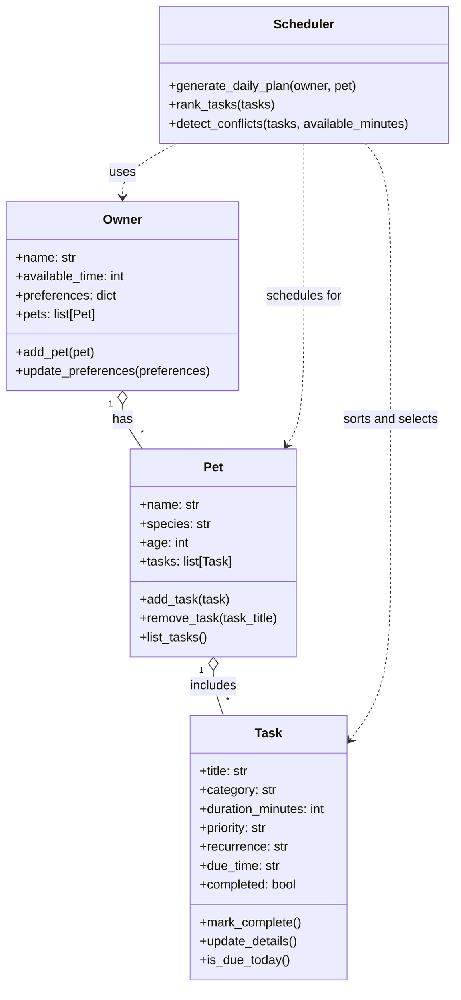

# PawPal+ Project Reflection

## 1. System Design

**a. Initial design**

- My initial design used four classes: `Owner`, `Pet`, `Task`, and `Scheduler`. I chose these classes because they map directly to the main parts of the problem: the person managing care, the animal receiving care, the individual care actions, and the logic that turns tasks into a daily plan.
- The `Owner` class is responsible for storing the owner's name, available time, preferences, and connected pets. Its role is to represent the human side of the system and provide the constraints the scheduler must respect.
- The `Pet` class is responsible for storing the pet's basic information and the list of care tasks assigned to that pet. Its role is to group tasks around a specific animal so the app can build schedules for the correct pet.
- The `Task` class is responsible for storing the details of each care activity, including title, category, duration, priority, recurrence, due time, and completion status. Its role is to represent the smallest unit of work that the scheduler will sort, filter, and schedule.
- The `Scheduler` class is responsible for the planning logic. Its role is to rank tasks, detect conflicts, and generate a daily plan based on the owner's available time and the pet's current task list.
- The main relationships are that one `Owner` can have multiple `Pet` objects, each `Pet` can have multiple `Task` objects, and the `Scheduler` depends on all three to produce an ordered schedule.

**b. Design changes**

- Yes. After reviewing the class skeleton, I changed the `Scheduler` design so it no longer stores its own `available_minutes` value.
- I made this change because the owner already stores available time, and keeping that information in two places would create an unnecessary synchronization problem. It would be easy for the two values to drift apart and produce confusing scheduling behavior.
- Instead, I kept time availability as part of the `Owner` data model and updated the scheduler interface so conflict detection can receive the available minutes it should use for a specific planning run. This keeps the scheduler more focused on logic and reduces the risk of inconsistent state.

---

## 2. Scheduling Logic and Tradeoffs

**a. Constraints and priorities**

- What constraints does your scheduler consider (for example: time, priority, preferences)?
- How did you decide which constraints mattered most?

**b. Tradeoffs**

- Describe one tradeoff your scheduler makes.
- Why is that tradeoff reasonable for this scenario?

---

## 3. AI Collaboration

**a. How you used AI**

- How did you use AI tools during this project (for example: design brainstorming, debugging, refactoring)?
- What kinds of prompts or questions were most helpful?

**b. Judgment and verification**

- Describe one moment where you did not accept an AI suggestion as-is.
- How did you evaluate or verify what the AI suggested?

---

## 4. Testing and Verification

**a. What you tested**

- What behaviors did you test?
- Why were these tests important?

**b. Confidence**

- How confident are you that your scheduler works correctly?
- What edge cases would you test next if you had more time?

---

## 5. Reflection

**a. What went well**

- What part of this project are you most satisfied with?

**b. What you would improve**

- If you had another iteration, what would you improve or redesign?

**c. Key takeaway**

- What is one important thing you learned about designing systems or working with AI on this project?
